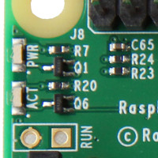

# PiPhoto Sync

PiPhoto Sync makes your raspberry pi automatically upload photos when you insert your SD cards.

Here is a video demo of it uploading photos to OSX via ssh:
[](https://www.youtube.com/watch?v=_iZTsNLnoRM)

It's pretty handy if your SLR doesn't have wifi and you want to copy your photos to a server/the cloud without opening your computer. [This blog post](https://lou.dev/blog/2020/piphoto/) discusses it's core components.

# Usage

Insert your sd card reader into the pi's usb port.

The status LED's on the pi are used for status:



The green led will start flashing as it is processed.

Once complete, the led's will indicate success of failure:
* :green_circle: A solid green indicates the job was successful
* :red_circle: A blinking red indicates the job failed

When you remove the sd card, the leds return to usual pi indicators.

# Destinations

PiPhoto lets you customize how it synchronizes your photos.

The `sync_command` (see below) in the config is the command that is executed when you insert your card. The simplest configuration just uses `rsync` to copy the files to a remote server.

I've written some notes on other setups you may like:

* [Copying and Organizing over SSH](destinations/ssh-copy-and-organize/README.md)
* [Lightroom Classic on Mac OSX](destinations/osx-lightroom-classic/README.md)
* more to come soon.

# Installation
Setup your pi, and then run
```
sudo ./install.sh
```

# Configuration

Create a new configuration file:
```
sudo cp config/piphoto.conf.example /etc/piphoto.conf
```
and edit it with your favorite editor.

The variables that need to be set are:
* **mount_point** - Where your sd card gets mounted (should match the point in the udev rules below.)
* **run_as_user** - The user to run the sync program as.
* **sync_command** - What command to run to sync the photos. (See _Destinations_ above).

# Notes Under The Hood

## udev
The udev rules are written to `/etc/udev/rules/99-mediastorage_card_instert_run.rules` during installation. 

They will configure your pi to mount usb devices to `/media` when inserted.

If you wish to change the mount point, edit the rules file and then run:
```
udevadm control --reload
```
Note also you'll need to make the mount point correspond in `piphoto.conf`

## systemd service
The install script creates the file `/etc/systemd/system/piphoto.service`. It instructs the system to run `phiphoto` when the sd card is mounted under the `pi` user.

If you are using a different default user, or want to change any behavior, edit the script and then run:

```
systemctl daemon-reload
```

The install script also enables the service by default.

# Debugging and Troubleshooting
Logs are accessible via journalctl:
```
journalctl -f -u piphoto.service
```

You can fire the udev trigger without re-inserting the card with:
```
sudo udevadm trigger --action=add <device>
```
where `<device>` is your device file like `/dev/sda` etc.

# License
MIT License (See [LICENSE file](LICENSE))